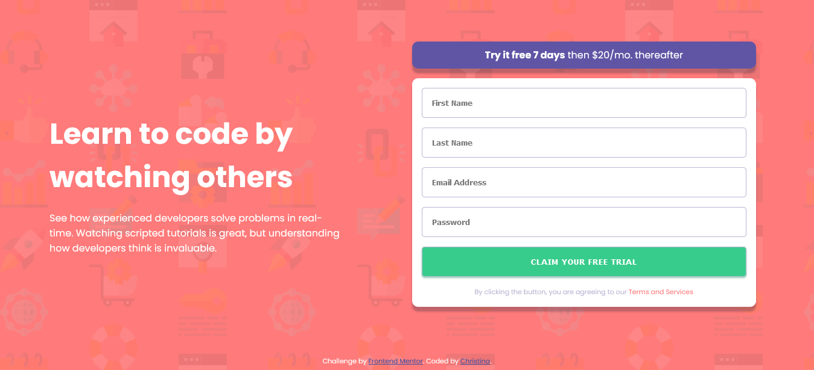

# Frontend Mentor - Intro component with sign up form solution

This is a solution to the [Intro component with sign up form challenge on Frontend Mentor](https://www.frontendmentor.io/challenges/intro-component-with-signup-form-5cf91bd49edda32581d28fd1). Frontend Mentor challenges help you improve your coding skills by building realistic projects. 

## Table of contents

- [Overview](#overview)
  - [The challenge](#the-challenge)
  - [Screenshot](#screenshot)
  - [Links](#links)
- [My process](#my-process)
  - [Built with](#built-with)
  - [What I learned](#what-i-learned)
  - [Continued development](#continued-development)
  - [Useful resources](#useful-resources)
- [Author](#author)

## Overview

### The challenge

Users should be able to:

- View the optimal layout for the site depending on their device's screen size
- See hover states for all interactive elements on the page
- Receive an error message when the `form` is submitted if:
  - Any `input` field is empty. The message for this error should say *"[Field Name] cannot be empty"*
  - The email address is not formatted correctly (i.e. a correct email address should have this structure: `name@host.tld`). The message for this error should say *"Looks like this is not an email"*

### Screenshot




### Links

- Live Site URL: [Github Pages Intro Component With Signup Form](https://ladylucyfurr.github.io/intro-component-with-signup-form-master/index.html)

## My process

### Built with

- Semantic HTML5 markup
- Flexbox
- Mobile-first workflow
- JavaScript

### What I learned

I started by building the mobile page to 375px. I created the first breakpoint at 600px where the one-column layout splits into two.

```css
@media screen and (min-width: 600px) {
    main {
        display: flex;
    }

    aside {
        align-self: center;
        padding-right: 20px;
    }

    header {
        padding: 10px 10%;
    }

    h1 {
        font-size: 2rem;
        padding-bottom: 20px;
    }
}
```

I used JavaScript to make sure form fields are filled out before the form can be submitted. The first example shows a change in the border color to red and displays an error message if the field is blank. The second example calls the function validateForm when the submit button is clicked.
```js
if (firstName.value === '') {
    firstName.style.borderColor = 'hsl(0, 100%, 74%)';
    document.getElementById('firstNameError').textContent = 'First Name cannot be empty';
}

var button = document.getElementById('submit');
button.addEventListener('click', validateForm);
```

### Continued development

This is the first project I've created with a mobile-first workflow. I've learned it's easier to make a page bigger than to make it smaller. I will continue to use this flow going forward.

This is also the first time I've used JavaScript to make a page interactive. I will learn more about the DOM, event handlers, and how to use for loops to loop through input fields.

### Useful resources

- [W3 Schools JavaScript HTML DOM](https://www.w3schools.com/js/js_htmldom.asp) - This gave me a good starting point for learning how to access and change elements in the DOM with JavaScript.

## Author

- Frontend Mentor - [@LadyLucyfurr](https://www.frontendmentor.io/profile/LadyLucyfurr)
